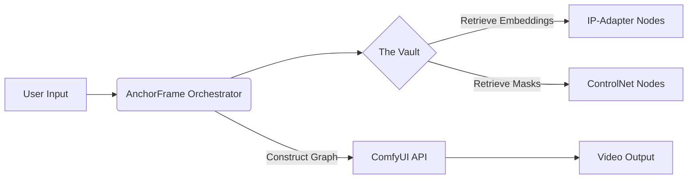

# AnchorFrame

[](https://opensource.org/licenses/MIT)
[](https://www.python.org/)
[](https://github.com/comfyanonymous/ComfyUI)

**AnchorFrame** is an open-source orchestration layer for generative AI video. It solves the "flicker" and "identity loss" problems by treating characters, props, and backgrounds as **stateful assets** rather than random generations.

It acts as a "Director" that injects consistent embeddings (IP-Adapter, ControlNet) into every frame of a diffusion pipeline, ensuring that "The Man" in Shot 1 is the exact same "Man" in Shot 2.

## 🚀 Key Features

  * **The Vault (Asset Management):** Upload a character *once*. AnchorFrame calculates and stores the IP-Adapter embedding tensors. You don't need to re-upload or re-prompt detailed descriptions; just reference `asset_id="actor_01"`.
  * **Scene Locking:** distinct separation of **Foreground** (Actors) and **Background** (Sets). Keep the background static (via Depth/Canny locks) while the character moves.
  * **Temporal Anchoring:** Automatically handles "frame chaining." The last frame of Shot A becomes the noise-initialization context for Shot B, ensuring smooth cuts.
  * **ComfyUI Bridge:** Built to sit on top of ComfyUI. We handle the complex JSON graph generation; you just write Python (or use the API).

## 🛠 Architecture

AnchorFrame does not train new models. It is a **Constraint Solver** for existing diffusion models.



## 📦 Installation

### Prerequisites

1.  **Python 3.10+**
2.  A running instance of [ComfyUI](https://github.com/comfyanonymous/ComfyUI) with the `--listen` argument enabled.

### Setup

```bash
git clone https://github.com/makalin/AnchorFrame.git
cd AnchorFrame
pip install -r requirements.txt
```

### Configuration

Rename `.env.example` to `.env` and point it to your backend:

```env
COMFY_UI_URL=http://127.0.0.1:8188
OUTPUT_DIR=./renders
```

## 💻 Usage

AnchorFrame allows you to direct video programmatically.

```python
from anchorframe import Director, Asset, Scene

# 1. Initialize the Director
director = Director(project="SciFi_Short")

# 2. Load Assets (Computed once, cached forever)
hero = Asset(name="Space_Captain", image_path="./ref/face.jpg", type="person")
prop = Asset(name="Raygun", image_path="./ref/gun.png", type="object")
bg = Scene(image_path="./ref/bridge.png", lock_camera=True)

# 3. Define the Shot
# AnchorFrame handles the IP-Adapter injection and ControlNet plumbing automatically
director.shoot(
    assets=[hero, prop],
    scene=bg,
    prompt="holding the raygun, looking worried at the screen",
    frames=48,
    motion_strength=0.6,
    seed=42
)

# 4. Render
director.action()
```

## 🧩 The "Brainstorm" Module (Roadmap)

We are currently working on implementing the following Logic Nodes:

  - [ ] **Pose Proxy:** A built-in stick-figure editor that generates OpenPose maps for precise movement control.
  - [ ] **Auto-Inpainting:** Automatically fixing "warped hands" by running a second pass on specific regions using the Asset embeddings.
  - [ ] **Dialogue Sync:** Integration with Wav2Lip to force mouth movement on the generated video.

## 🤝 Contributing

We welcome contributions\! Please see `CONTRIBUTING.md` for details on how to submit a Pull Request.

1.  Fork the Project
2.  Create your Feature Branch (`git checkout -b feature/AmazingFeature`)
3.  Commit your Changes (`git commit -m 'Add some AmazingFeature'`)
4.  Push to the Branch (`git push origin feature/AmazingFeature`)
5.  Open a Pull Request

## 📄 License

Distributed under the MIT License. See `LICENSE` for more information.

-----

**AnchorFrame** is a project by [Digital Vision](https://dv.com.tr).
Maintained by [@makalin](https://github.com/makalin).
