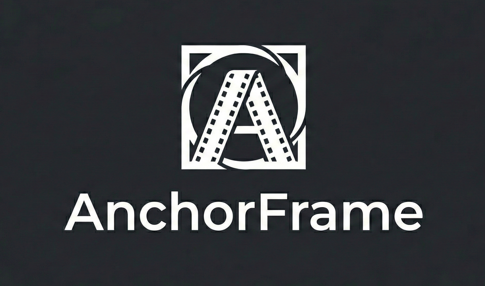
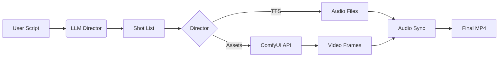

# AnchorFrame



[](https://opensource.org/licenses/MIT)
[](https://www.python.org/)
[](https://github.com/comfyanonymous/ComfyUI)

**AnchorFrame** is an open-source orchestration layer for generative AI video. It transforms ComfyUI into a fully automated "Movie Studio" by treating characters, props, and backgrounds as **stateful assets**.

It acts as a "Director" that injects consistent embeddings (IP-Adapter, ControlNet) into every frame, manages audio synchronization, and even parses screenplays.

## 🚀 Key Features

*   **The Vault (Asset Management):** Upload a character *once*. AnchorFrame calculates and stores embeddings.
*   **LLM Director:** Feed in a text script (screenplay format) and watch it turn into directed shots.
*   **Audio Studio:** Integrated Text-to-Speech (ElevenLabs) and Lip Sync (Wav2Lip) pipeline.
*   **Pose Proxy:** Generate synthetic OpenPose stick figures programmatically.
*   **Video Assembler:** Automatically stitches generated frames into ready-to-watch MP4 videos.
*   **CLI:** Manage projects from the command line.

## 📦 Installation

### Prerequisites

1.  **Python 3.10+**
2.  A running instance of [ComfyUI](https://github.com/comfyanonymous/ComfyUI) with the `--listen` argument enabled.

### Setup

```bash
git clone https://github.com/makalin/AnchorFrame.git
cd AnchorFrame
pip install -r requirements.txt
```

### Configuration

Rename `.env.example` to `.env` and point it to your backend:

```env
COMFY_UI_URL=http://127.0.0.1:8188
OUTPUT_DIR=./renders
ELEVEN_LABS_API_KEY=your_key_here
```

## 🎬 Usage

### The "Movie Studio" Workflow

You can run a full script-to-video pipeline using the main driver:

```python
from anchorframe import Director
from anchorframe.logic import LLMDirector
from anchorframe.providers import LocalComfyProvider

# 1. Initialize
director = Director("SciFi_Epic", provider=LocalComfyProvider("http://127.0.0.1:8188"))

# 2. Write Script
script = """
[INT_SPACESHIP]
CAPTAIN: "Shields are down!" (Action: looking at console)
"""

# 3. Direct
shots = LLMDirector().convert_script(script)
for shot in shots:
    director.shoot(..., prompt=shot['prompt'], audio_text=shot['dialogue'])

# 4. Action!
director.action()
```

### CLI

```bash
# Initialize a new project
python cli.py init MyMovie

# Run the demo
python cli.py demo --dry-run
```

## 🛠 Architecture



## 🤝 Contributing

We welcome contributions! Please see `CONTRIBUTING.md`.

## 📄 License

Distributed under the MIT License.

-----

**AnchorFrame** is a project by [Digital Vision](https://dv.com.tr).
Maintained by [@makalin](https://github.com/makalin).
